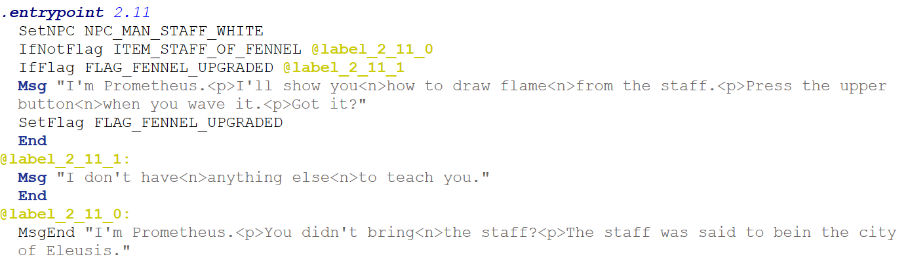

# Hephaestus Toolworks – Forge

Hephaestus Toolworks – Forge is a command-line tool for extracting and rebuilding  
the scripting layer of the NES game *The Battle of Olympus*.

It supports full round-trip editing:

ROM → ASM → ROM

The extracted ASM is readable and editable, and can be assembled back into the ROM  
without unintended changes.

---

## Features

- Extract scripting layer from ROM to ASM
- Rebuild and inject scripts back into ROM
- Byte-stable round-trip (no unintended modifications)
- Label-based control flow (no manual pointer editing)
- Automatic string deduplication
- Validation of opcodes, labels, and arguments
- Supports US/EU ROMs

---

## Usage

    forge x <input.nes> <output.asm>    Extract scripting layer from ROM
    forge b <input.asm> <output.nes>    Build and patch ROM from ASM

### Examples

    forge x boo-us.nes script.asm
    forge b script.asm boo-us.nes

The patched ROM will be written to:

    boo-us-out.nes

---

## Example Script

---

## Notes

- Scripts are organized by `.entrypoint <world>.<room>`
- Labels (`@label:`) are resolved automatically
- Strings are written inline and deduplicated where needed
- The assembler validates structure and reports errors

---

## Status

This is an early release (beta-1), but the tool is stable and fully usable.

More features and improvements will follow.

---

## Documentation

See `docs/forge.md` for more details about the ASM format and scripting system.

---

## Disclaimer

This tool does not include any game data. You must provide your own ROM.

---

## Author

Kai E. Frøland  
kai.froland@gmail.com
